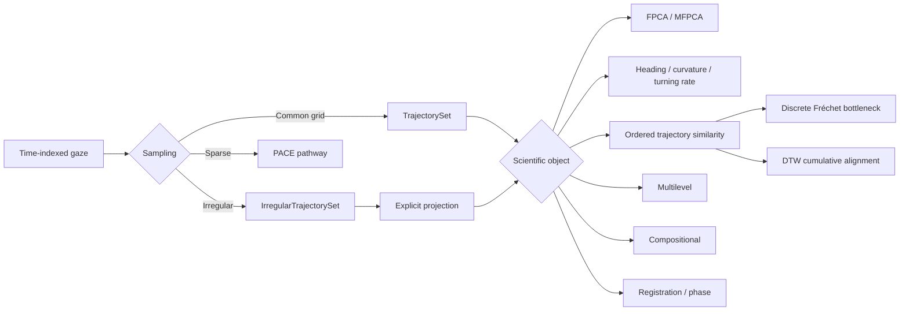
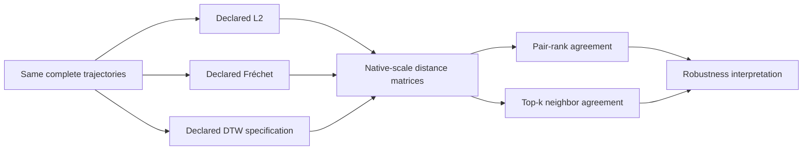
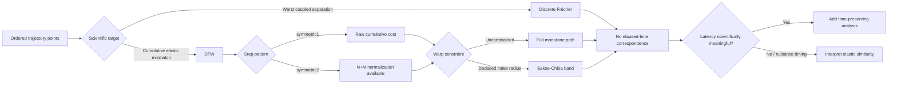
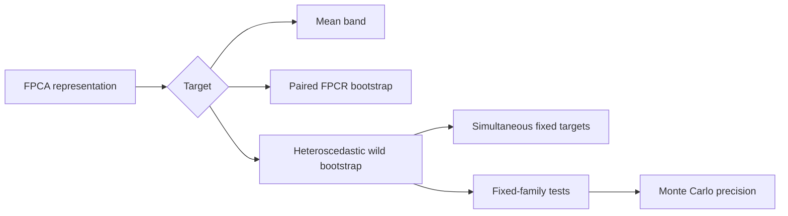
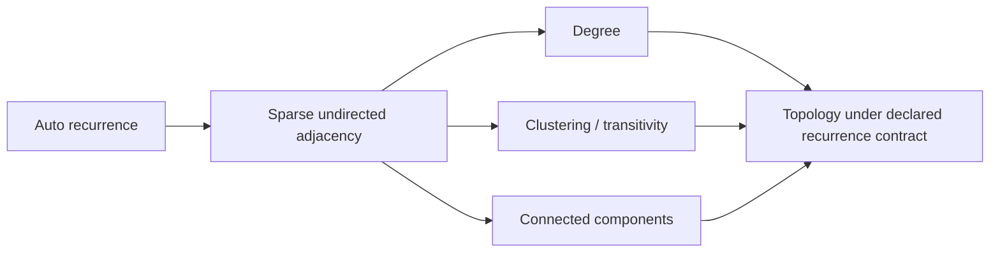
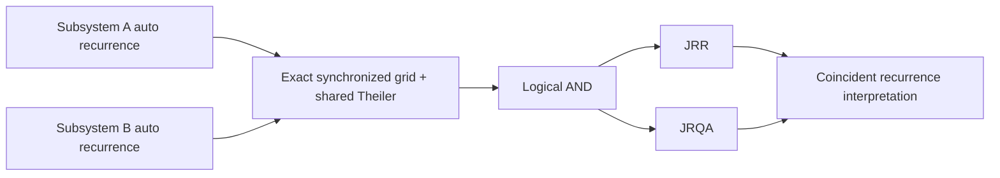
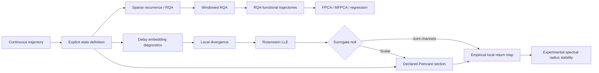
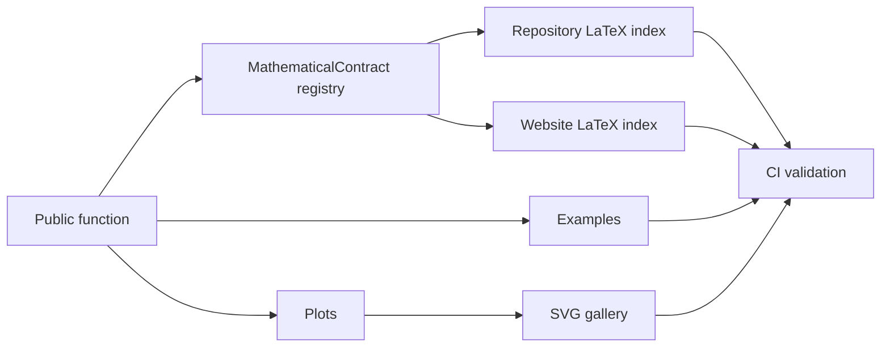

# Workflow atlas

GitHub renders these Mermaid diagrams directly in the repository. The website contains the expanded atlas with links to the function-equation registry, worked examples, and visual gallery.

## Representation



## Repeated-measures functional regression

```mermaid
flowchart LR
    A[Repeated Y_ij(t)] --> B[Trial-level scalar design]
    A --> C[Participant groups]
    B --> D[Declared B-spline fixed effects]
    C --> E[Declared participant functional random effects]
    D --> F{Trial functional effect?}
    E --> F
    F -->|No| R{Residual family?}
    F -->|Yes| N[Validate hierarchy + declare trial basis/Psi_T]
    N --> R
    R -->|iid + no trial effect| M[Historical joint Gaussian MixedLM]
    R -->|exponential / AR1 or trial effect| P[Profiled participant-block Gaussian likelihood]
    P --> S{Participant random slope?}
    M --> S
    S -->|Yes| T[Check within-participant variation + covariance complexity]
    S -->|No| G[Retain covariance hierarchy]
    T --> G
    G --> Q[Inspect Psi_P / Psi_T / residual parameter + BLUP diagnostics]
    Q --> X[Raw residual ACF / variogram]
    Q --> Y[0.49 within-trial whitened residual diagnostics]
    Q --> H{Whole-function inference?}
    H -->|Yes| I[Resample whole participants with all trials]
    I --> J[Fixed-covariance GLS or full declared-model refit]
    J --> K[Observed-grid simultaneous bands]
    K --> L{Predeclared covariance alternatives?}
    L -->|Yes| Z[0.50 compare already fitted structures against declared reference]
    Z --> ZA[Coefficient / band / variance / raw+white residual / IC sensitivity]
    ZA --> ZB[Report robustness; no ranking or automatic winner]
```

Whole participants remain the resampling unit. Residual covariance is block
diagonal by trial. Exponential correlation is defined on physical time; AR(1)
uses index steps and requires a regular grid. The fixed-covariance bootstrap
conditions on every fitted covariance term, while the full-refit bootstrap
re-estimates participant covariance, optional trial covariance, residual
variance, and phi/rho without reselecting the covariance family.

Version 0.50 is a separate comparison layer over already fitted, predeclared
structures. It requires identical scientific inputs and likelihood mode,
retains failed declarations, and reports robustness without selecting a model.


## Functional response regression

```mermaid
flowchart LR
    A[Functional response Y_ij(t)] --> B{Response family}
    B -->|Continuous Gaussian| C{Repeated trials?}
    C -->|No independent curves| D[0.35 observed-grid FoSR OLS]
    C -->|Yes participant-level predictors only| E[Participant-average FoSR]
    C -->|Yes trial-varying predictors| F[Gaussian functional mixed effects]
    B -->|Bernoulli 0/1| G[0.51 marginal generalized FoSR: logit]
    B -->|Poisson counts| H[0.51 marginal generalized FoSR: log]
    G --> I[Participant GEE clusters + working independence]
    H --> I
    I --> J[Robust sandwich covariance]
    J --> K[Whole-participant case bootstrap refits]
    K --> L[Observed-grid link-scale simultaneous bands]
```

The 0.51 generalized path is population averaged rather than conditional on
functional random effects. It allows trial-varying predictors, fixes working
independence, and does not select a family, link, basis size, or working
correlation automatically.

## Trajectory-distance robustness



No consensus metric, p-value, or preferred distance is constructed automatically.

## Ordered trajectory comparison



## Inference



## Recurrence network



Graph topology remains threshold- and Theiler-dependent; no automatic
dimension or chaos interpretation is made.

## Joint recurrence



No cross-state distance, lag optimization, or causal direction is implied.

## Nonlinear dynamics



Overlapping RQA windows remain within-curve dependent summaries; the source curve/participant remains the downstream sampling unit. Classical Floquet/monodromy and continuation analysis are intentionally excluded from the raw-gaze pathway.

## Documentation contract



Website: https://stefanosbalaskas.github.io/eyetrajectoriespy/methods/workflow-atlas/

### Directed discrete-state dependence

```text
predeclared discrete source/target states
  -> explicit target history k + source history l + source lag d
  -> discrete_transfer_entropy()
  -> local history/support diagnostics
  -> optional analyst-declared circular shifts
  -> transfer_entropy_circular_shift_test()
  -> reporting with no automatic causal claim
```

See `docs/methods/transfer-entropy.md` and the
`discrete-transfer-entropy` mathematical contract.

### Transfer-entropy robustness multiverse

```text
predeclared discrete source/target states
  -> declare target-history grid K
  -> declare source-history grid L
  -> declare source-lag grid D
  -> full Cartesian K x L x D
  -> transfer_entropy_parameter_sensitivity()
      -> one row per declared specification
      -> TE + empirical support diagnostics
      -> optional identical circular-shift null per row
      -> descriptive robustness summary
      -> no automatic winner / hidden averaging
```

### Conditional transfer entropy

```text
explicit discrete source X
explicit discrete target Y
explicit discrete condition Z
        |
        +--> declare k: target history
        +--> declare l: source history
        +--> declare m: condition history
        +--> declare d: source lag
        +--> declare c: condition lag
                    |
                    v
 conditional_transfer_entropy()
        |           |
        |           +--> exact local histories + support diagnostics
        +--> incremental directed predictive information
                    |
                    +--> optional analyst-declared source-only shifts
                    |       target Y fixed
                    |       condition Z fixed
                    v
 conditional_transfer_entropy_circular_shift_test()
                    |
                    v
      no causal-identification claim
```
