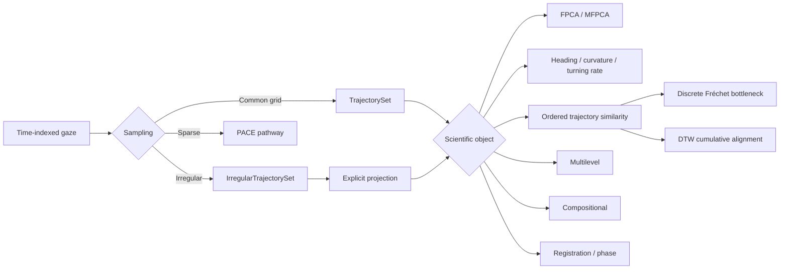
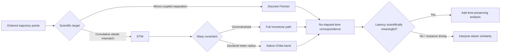
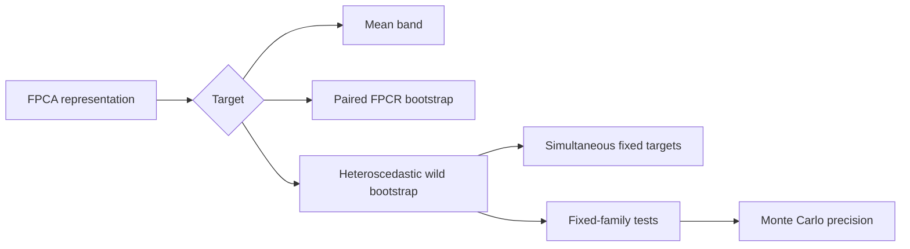
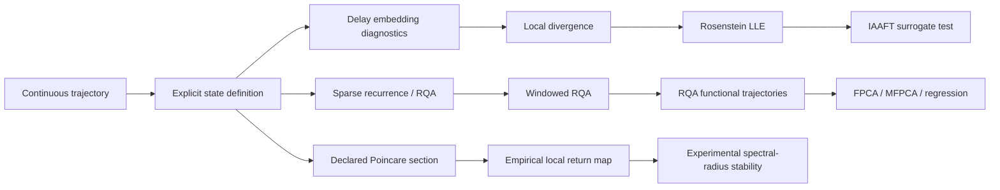
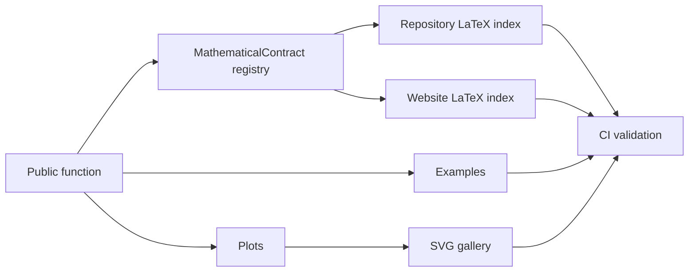

# Workflow atlas

GitHub renders these Mermaid diagrams directly in the repository. The website contains the expanded atlas with links to the function-equation registry, worked examples, and visual gallery.

## Representation

## Ordered trajectory comparison

## Inference

## Nonlinear dynamics

Overlapping RQA windows remain within-curve dependent summaries; the source curve/participant remains the downstream sampling unit. Classical Floquet/monodromy and continuation analysis are intentionally excluded from the raw-gaze pathway.

## Documentation contract

Website: https://stefanosbalaskas.github.io/eyetrajectoriespy/methods/workflow-atlas/
