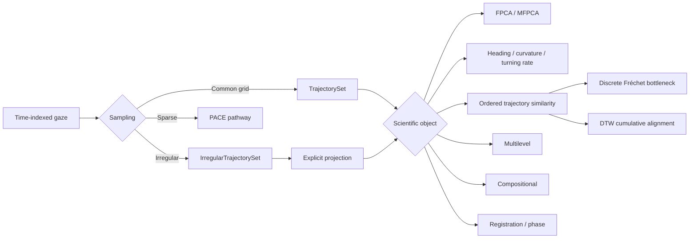
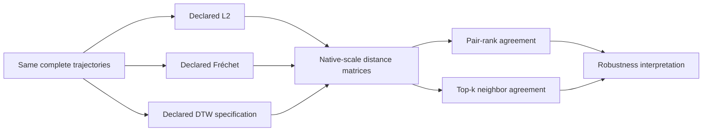
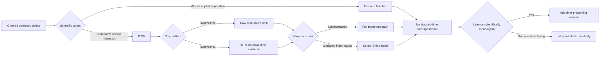
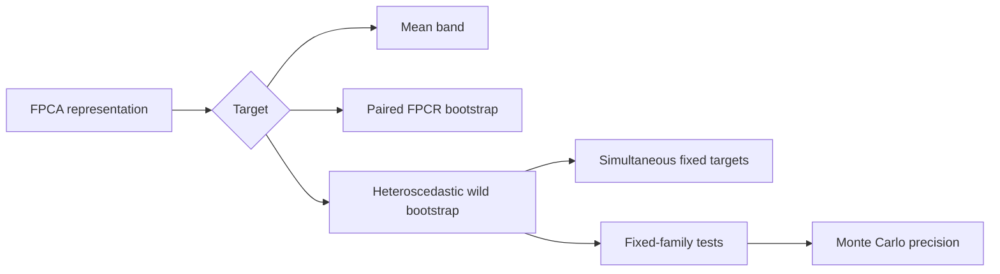
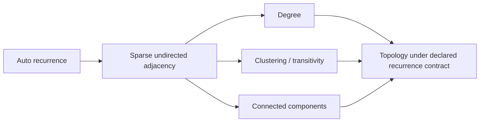
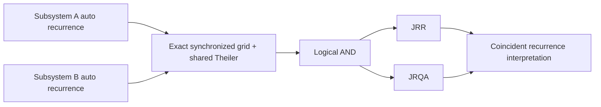
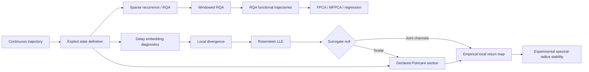
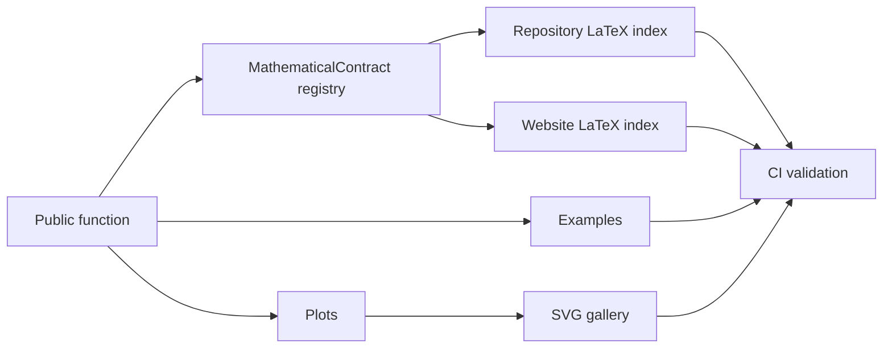

# Workflow atlas

GitHub renders these Mermaid diagrams directly in the repository. The website contains the expanded atlas with links to the function-equation registry, worked examples, and visual gallery.

## Representation



## Repeated-measures functional regression

```mermaid
flowchart LR
    A[Repeated Y_ij(t)] --> B[Trial-level scalar design]
    A --> C[Participant groups]
    B --> D[Declared B-spline fixed effects]
    C --> E[Declared participant functional random intercept]
    D --> F[One joint Gaussian MixedLM]
    E --> F
    F --> G[beta(t) + participant random functions]
```

## Functional response regression

```mermaid
flowchart LR
    A[Functional response Y(t)] --> B{Inference unit}
    B -->|Independent curves| C[Curve-level design]
    B -->|Repeated trials + participant-level predictors| D[Participant-average response]
    D --> E{Predictors constant within participant?}
    E -->|No| F[Defer to functional mixed effects]
    E -->|Yes| G[Participant-level design]
    C --> H[Observed-grid function-on-scalar OLS]
    G --> H
    H --> I[HC1 pointwise SE]
    H --> J[Whole-function wild bootstrap]
    J --> K[Coefficient/family simultaneous bands]
```

## Trajectory-distance robustness



No consensus metric, p-value, or preferred distance is constructed automatically.

## Ordered trajectory comparison



## Inference



## Recurrence network



Graph topology remains threshold- and Theiler-dependent; no automatic
dimension or chaos interpretation is made.

## Joint recurrence



No cross-state distance, lag optimization, or causal direction is implied.

## Nonlinear dynamics



Overlapping RQA windows remain within-curve dependent summaries; the source curve/participant remains the downstream sampling unit. Classical Floquet/monodromy and continuation analysis are intentionally excluded from the raw-gaze pathway.

## Documentation contract



Website: https://stefanosbalaskas.github.io/eyetrajectoriespy/methods/workflow-atlas/

### Directed discrete-state dependence

```text
predeclared discrete source/target states
  -> explicit target history k + source history l + source lag d
  -> discrete_transfer_entropy()
  -> local history/support diagnostics
  -> optional analyst-declared circular shifts
  -> transfer_entropy_circular_shift_test()
  -> reporting with no automatic causal claim
```

See `docs/methods/transfer-entropy.md` and the
`discrete-transfer-entropy` mathematical contract.
