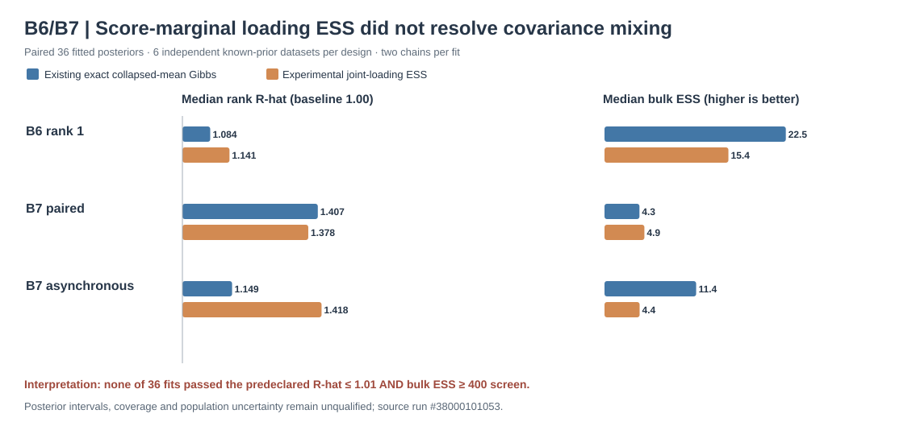

# B6/B7: exact score-integrated joint loading elliptical-slice research

**Experimental opt-in only. Native Gibbs defaults and published stable 1.1.0 are unchanged.** This programme follows the independently validated score-marginal likelihood in the PyMC/NUTS reference and the observed native covariance R-hat/ESS failures. It does not assert scientific posterior calibration.

## Numerical transition

Under the fixed-rank Gaussian factor model, for each independently observed participant `i` and native coordinate channel `d`, let `G_id = B_id.T B_id`, `c_id = B_id.T y_id`, `mu_d` be mean coefficients, `L_d` the Gaussian-prior loading matrix, and `sigma_d` fixed observation noise. Integrating all participant scores `z_i ~ N(0,I)`, the loading-dependent marginal log-likelihood is

$$
\ell(L\mid \mu,Y) = \frac{1}{2}\sum_i
\left[v_i^T Q_i^{-1}v_i - \log|Q_i|\right],
\quad
Q_i = I + \sum_d \sigma_d^{-2}L_d^T G_{id}L_d,
\quad
v_i = \sum_d \sigma_d^{-2}L_d^T(c_{id}-G_{id}\mu_d).
$$

This excludes terms constant in loading for a fixed mean, not terms needed for Bayesian comparison across different values of the mean. The B6 (single-channel) and B7 (joint planar, paired/asynchronous native timestamps) likelihoods use the **same** independent participants, original Gram matrices and observation noise, without interpolation. Unlike per-channel `L|mu,z,Y` Gibbs, the joint elliptical-slice step targets `L|mu,Y` with all scores integrated. Its elliptical prior direction preserves the unchanged multivariate Gaussian loading prior exactly, without tuning an acceptance probability.

After joint loading update, the existing exact score-integrated population mean conditional is drawn (when the pre-existing option is selected), followed by independent Gaussian participant-score conditionals `z|mu,L,Y`. This partial-collapse sequence maintains the joint target. The prior `mu,L,z`, factor rank, coordinate basis, likelihood, and stable non-ESS defaults are unchanged. Extensive coverage and independent posterior agreement are not yet established.

## First-wave test design

- Independent dense multivariate Gaussian likelihood differential tests for B6 rank 1, B7 rank 1, and B7 rank 2, so there is a separate *mathematical* reference rather than solely testing against the native sampler.
- Python 3.11–3.13 reference, invalid-argument, deterministic ESS, paired/asynchronous and nonpublication-gate checks.
- **36 actual fitted native posteriors**, derived from 18 new independent known-prior datasets: B6 rank 1, B7 rank 1 paired and B7 rank 1 asynchronous × six truth replicates × two options (existing exact collapsed-mean Gibbs versus joint score-marginal loading ESS).
- Two chains, 350 warmup sweeps + 250 posterior draws per fit, with preregistered R-hat, bulk and tail ESS on the *identifiable* midpoint mean and covariance, failure counts, known truth and marginal 90% interval inclusion. ESS work counts are captured; no failed cases are discarded.
- Original per-design case CSVs, scientific ledgers and SHA256 checksums are retained and subsequently cross-audited before interpretation.

This is a **small diagnostic mixing pilot**. Its 90% truth inclusion counts are not nominal credible-interval coverage evidence. R-hat ≤ 1.01 and bulk ESS ≥ 400 are predeclared per-chain functional diagnostic screens, not grounds for release qualification or architecture promotion. Fitting success, posterior mean similarity or source CI passing do not certify convergence. The independent full PyMC/NUTS posterior comparisons remain a separate reference.

## Gates

`score_marginal_loading_ess_experimental_opt_in=false` by default; `score_marginal_loading_ess_scientifically_qualified=false`, `posterior_mixing_scientifically_qualified=false`, and `release_authorized=false`. Keep scientific blocker [#255](https://github.com/stefanosbalaskas/eyetrajectoriespy/issues/255) open until independent SBC and rank-two functional covariance validation after adequate sampling are completed.

## First-wave empirical mixing results (36 actual fits)

The corrected original [science workflow #38000101053](https://github.com/stefanosbalaskas/eyetrajectoriespy/actions/runs/38000101053) completed all **36 true native fitting attempts** (three designs × six independent matched prior-generated datasets × two methods), with **zero errors** in the three actual fitting shards. The unit-test matrix independently verified the marginal Gaussian algebra on Python 3.12 and 3.13 at the time of this evidence update; Python 3.11 and source-combined audit were still pending. Source design-specific artifacts: B6 `11649540044`, paired B7 `11649325340`, asynchronous B7 `11648876398`.

| Design | Original collapsed mean: median covariance R-hat / bulk ESS | Joint score-marginal loading ESS: median covariance R-hat / bulk ESS |
|---|---|---|
| B6 rank1 | **1.084 / 22.5** | 1.141 / 15.4 |
| B7 rank1 paired | 1.407 / 4.3 | **1.378 / 4.9** |
| B7 rank1 asynchronous | **1.149 / 11.4** | 1.418 / 4.4 |

No individual fitting dataset passed the prespecified joint identified covariance mixing screen (rank R-hat <= 1.01 *and* bulk ESS >= 400). The opt-in joint loading ESS therefore **did not reliably improve covariance mixing**. It exhibited a slight paired-B7 improvement and worse B6/asynchronous behavior within this limited data-generating design. The 90% posterior covariance intervals contained their known truth in 6/6 versus 5/6 (B6), 5/6 versus 4/6 (B7 paired), and 5/6 versus 5/6 (B7 asynchronous), in the order original versus new ESS. These n=6 counts are descriptive, not valid frequentist posterior coverage evidence.

**Scientific decision:** retain this exact transition as an optional research comparator with its default `False`. Do not adopt it as a mixing remedy, select its hyperparameters based on these results, or certify population uncertainty. Investigate the actual posterior geometry and noncentering/parameter expansion against the independent NUTS posterior, with longer chains and rank-invariant diagnostics. Release and inferential gates remain **false**.
