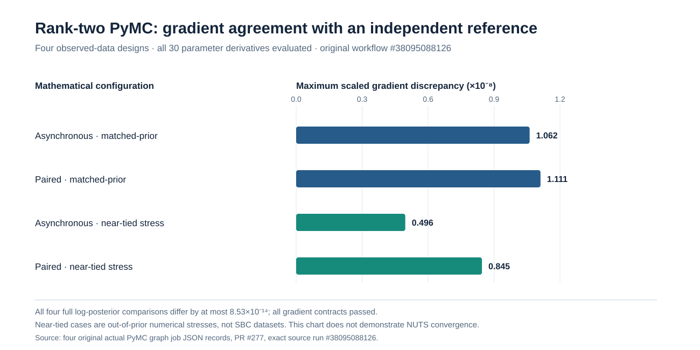

# Rank-two PyMC log-posterior and automatic-differentiation study R2

**Research only.** This study follows rank-two dense-Gaussian versus Woodbury
mathematical identity validation in [PR #273](https://github.com/stefanosbalaskas/eyetrajectoriespy/pull/273),
but does not assume that independently correct numerical algebra implies a
correct PyMC/PyTensor posterior graph.

Four predeclared cases (paired/asynchronous × matched-Gaussian/near-tied)
instantiate an **actual PyMC** rank-two normal-prior model with a low-rank
score-marginal likelihood Potential. Its compiled full log posterior, including
all normal-prior normalization constants, is compared to a separately
implemented full dense observation-space Gaussian log likelihood plus normal
priors. Its PyTensor automatic derivatives are checked against independent
two-sided finite differences of the dense reference for all 30 parameters.
Loading rotation invariance is independently checked for the full posterior
under isotropic Gaussian loading priors and for population covariance.

Near-tied equal-eigenvalue configurations are explicitly **outside the
matched loading-generating prior** and constitute mathematical stress, not
SBC or posterior-coverage evidence. Each configuration retains its log-value
discrepancy, scaled-gradient discrepancy, covariance and rotational checks,
fit exceptions, and SHA256 source artifacts. Predeclared tolerances are
absolute log posterior <5e-6 and maximum scaled gradient discrepancy <3e-3.

**No rank-two NUTS sampling occurs in this stage.** Passing a differentiable
graph contract only unlocks independent four-chain computational reference
experiments. It cannot establish rank-two posterior convergence, rank-SBC
uniformity, nominal 90% interval coverage, or release qualification.
Scientific blocker #255 and every publication/production gate remain open.

## Completed original source evidence — 11 October 2026

The source research PR is [#277](https://github.com/stefanosbalaskas/eyetrajectoriespy/pull/277), at original experiment head `131f28a26332ad9211400ac4128658b06b5bdad3`. [Original scientific workflow #38095088126](https://github.com/stefanosbalaskas/eyetrajectoriespy/actions/runs/38095088126) passed **5/5 scientific jobs**: four actual PyMC graph evaluations plus the independent contract test job. The exact-head engineering matrix passed **25/25**. All four individually retained scientific cases report `status=ok` and `pymc_full_graph_and_gradient_contract_passed=true`.

### Four original numerical comparisons

| Mathematical configuration | Absolute full log-posterior discrepancy | Maximum scaled gradient discrepancy | Rotated full log-posterior discrepancy | Maximum rotated covariance discrepancy | Retained original artifact |
|---|---:|---:|---:|---:|---|
| Asynchronous · matched loading prior | 8.53×10⁻¹⁴ | 1.06×10⁻⁸ | 5.68×10⁻¹⁴ | 1.39×10⁻¹⁷ | `11685812328` |
| Paired · matched loading prior | 8.53×10⁻¹⁴ | 1.11×10⁻⁸ | 5.68×10⁻¹⁴ | 1.39×10⁻¹⁷ | `11685872136` |
| Asynchronous · near-tied stress | 0 | 4.96×10⁻⁹ | 0 | 5.20×10⁻¹⁸ | `11685108432` |
| Paired · near-tied stress | 5.68×10⁻¹⁴ | 8.45×10⁻⁹ | 5.68×10⁻¹⁴ | 3.47×10⁻¹⁸ | `11685956885` |

These are **actual comparisons of compiled PyMC/PyTensor normal-prior + low-rank score-marginal Potential with an independent dense-Gaussian full log posterior**, with independent two-sided numerical derivatives for **30 parameters in each design**. This is not a comparison of two expressions that share one computational graph. The checked unconstrained normal-prior coordinates have no nontrivial parameter-transform Jacobian; later parameterizations introducing constrained distributions need their own transform/Jacobian audit.

The near-tied equal-eigenvalue cases are **out-of-prior stress tests**, not draws from the matched prior and not evidence of SBC. The prespecified tolerances were absolute log-posterior difference <5×10⁻⁶ and scaled derivative difference <3×10⁻³. The original source's reported discrepancies are far smaller in all four studied cases.

The original workflow artifacts and checksum files are accessible from [scientific run #38095088126](https://github.com/stefanosbalaskas/eyetrajectoriespy/actions/runs/38095088126). This source-accurate figure visualizes the four reported gradient errors only; **no new posterior fitting or human eye-tracking data** were generated by preparing the site.

**Scientific interpretation:** the actual rank-two posterior implementation passes the **tested mathematical identity and gradient checkpoint**; this does **not** validate NUTS convergence, mixing under rotationally nonidentified loading geometry, population-covariance interval calibration, predictive uncertainty, fixed-parameter coverage, general designs, or a production backend. The next research step is a prespecified failure-inclusive rank-two four-chain NUTS pilot on matched-prior paired and asynchronous data, with any near-tied scenarios separately labeled as stress tests. Keep [Bayesian blocker #255](https://github.com/stefanosbalaskas/eyetrajectoriespy/issues/255) open and 1.2 release unauthorized.
