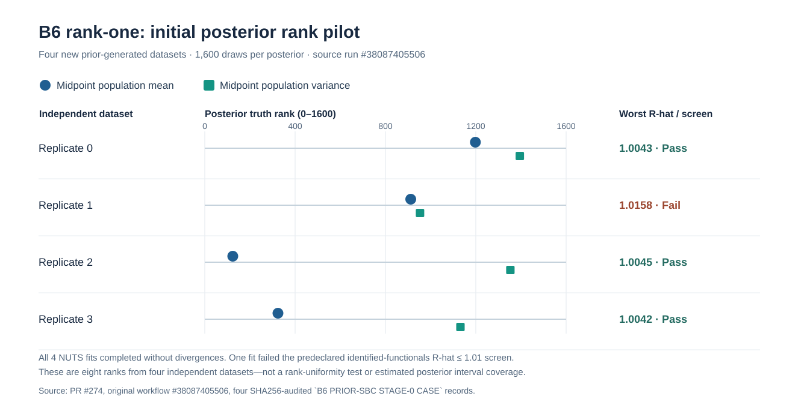

# B6 rank-one: first staged independent-NUTS prior-SBC and coverage pilot

!!! danger "Not enough independent datasets for calibration claims"
    Four fresh matched-prior datasets **cannot** establish SBC rank
    uniformity or 90% credible-interval coverage. All scientific and release
    gates remain closed. The stable package is still 1.1.0.

The source code predeclares four **new independent prior-generated** B6
rank-one sparse univariate datasets, using a separate seed namespace from
four-chain reference study R1. Each receives the independent score-marginal
PyMC/NUTS model with 4 chains, 700 warmup and 400 retained draws per chain.
These are deliberately shorter pilot fits to assess cost and failure modes,
*not* retrospectively selected well-mixed chains.

The two primary invariant targets are the population x mean and x variance
at the grid midpoint. For each: preserve the full four-chain ArviZ diagnostic,
a discrete truth-versus-posterior SBC rank with reproducible tie handling and
one truth-in-90%-interval flag. All six time-indexed functionals remain in the
diagnostic evidence, but **only one rank per primary quantity per independent
dataset** enters preliminary rank and coverage summaries. A 10-bin rank
histogram with only four ranks is merely bookkeeping, not an interpretable
uniformity test.

Dataset-level denominator, fit errors, sampling-screen failures and individual
source hash checks are retained. Preliminary binomial intervals are exact
Clopper-Pearson intervals among successful fits and explicitly report total
attempts, so failures are not silently removed.

Next prespecified calibration stage should set a *simulation-precision*
target, e.g. approximate 95% Monte Carlo half-width ≤.06 for a nominal 90%
event needs roughly 100 independent successfully assessed datasets, while
failed/nonconverged runs need explicit handling. No fixed-parameter
frequentist coverage is studied here: that requires fixing a generating
functional truth across repeated observation datasets, distinct from
generating truth itself from the prior every replication.

B7 prior calibration, a rank-two posterior reference, posterior predictive
checking, implementation model audits and power/cost scaling remain separate
workstreams under scientific issue #255. Public release flags remain false.

## Completed corrected-source pilot — 11 October 2026

The first [scientific workflow #38087242217](https://github.com/stefanosbalaskas/eyetrajectoriespy/actions/runs/38087242217) failed **before posterior sampling** because direct script execution could not resolve the repository `scripts` import. This is an **entrypoint/harness failure**, not posterior nonconvergence or an SBC rank. The correction preserved the statistical model, sampling configuration, seeds and rank definitions.

The corrected source [workflow #38087405506](https://github.com/stefanosbalaskas/eyetrajectoriespy/actions/runs/38087405506) on experimental [PR #274](https://github.com/stefanosbalaskas/eyetrajectoriespy/pull/274) head `3011666b6caeb7e38455a5b439e92bb305ea3be3` finished **8/8 science jobs**, including **four actual four-chain posterior fits**, and passed the checksum-verified failure-inclusive summary. The full corrected PR head passed **25/25 engineering workflows**. Each fit uses 700 warmup and 400 retained draws per chain: this budget is intentionally shorter than R1's 1,200 / 800 setting.

| Independent dataset | Worst rank R-hat across six B6 functionals | Minimum bulk ESS | Divergences | Exploratory computational screen |
|---|---:|---:|---:|---|
| Replicate 0 | 1.0043 | 418 | 0 | Passed |
| Replicate 1 | **1.0158** | 543 | 0 | **Failed**: x-mean at quarter and three-quarter grid |
| Replicate 2 | 1.0045 | 586 | 0 | Passed |
| Replicate 3 | 1.0042 | 575 | 0 | Passed |

The predeclared screen was rank R-hat ≤1.01, bulk/tail ESS ≥400, BFMI ≥0.3 and zero divergences across all identified population functionals. The failure remained in the scientific ledger even though the posterior fit completed successfully.

### Prespecified midpoint truth ranks — original case records

| B6 generating dataset | x-mean truth rank (of 1,600 posterior draws) | x-variance truth rank (of 1,600 draws) | Midpoint 90% interval inclusion |
|---|---:|---:|---|
| Replicate 0 | 1,198 | 1,395 | Both true values included |
| Replicate 1 | 912 | 953 | Both included; computational screen failed elsewhere |
| Replicate 2 | 124 | 1,353 | Both included |
| Replicate 3 | 324 | 1,132 | Both included |

For each midpoint quantity, observed prior-predictive interval inclusion was **4/4 completed fits**, with exact 95% binomial interval approximately **39.8%–100%**. These eight outcome checks are dependent within the four independent datasets, not eight independent calibration observations. The four variance ranks happen to be above the midpoint; the sample is far too small to diagnose rank bias or evaluate histogram uniformity.

Source artifacts: four replicate case ledgers `11682921911`, `11683660208`, `11683911505`, `11683087449`, and failure-inclusive aggregate `11683762021` ([original source run](https://github.com/stefanosbalaskas/eyetrajectoriespy/actions/runs/38087405506)). The SVG plots only the original retained ranks and diagnostic R-hat values; it is not additional Monte Carlo evidence.

**Decision:** the implementation and rank bookkeeping are operational, but only three of four completed datasets pass the exploratory computational screen, and four datasets cannot quantify SBC rank uniformity or credible-interval coverage. A follow-up should independently refit replicate 1 using the full R1 1,200/800 budget, then expand under a prespecified convergence and simulation-precision protocol, retaining all attempts as denominator observations. Neither fixed-truth coverage nor B7/rank-two SBC was performed; posterior calibration and the 1.2 release remain unqualified. [Scientific blocker #255](https://github.com/stefanosbalaskas/eyetrajectoriespy/issues/255) remains open.
