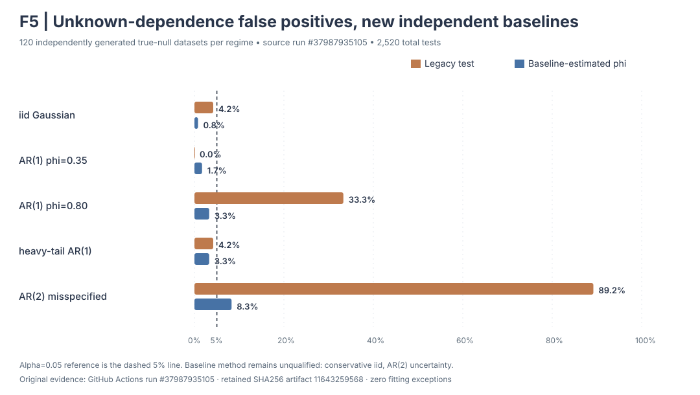

# F5: unknown dependence from a disjoint stationary baseline — research only

**Experimental reference implementation. Not a qualified inferential test, nor
a replacement for the legacy functional CUSUM bootstrap.**

## Why a third research prototype?

The original weak-block bootstrap reported false-positive rates of
**99/200=49.5%** under true Gaussian AR(1) $\phi=.8$ at nominal
$\alpha=.05$. The known-true-$\phi$ comparator lowered this to
**16/200=8.0%**, but it requires a nuisance parameter that real
eye-tracking users cannot generally know. Original fitted 1,800-test
evidence is retained in artifact `11639020647`, checksum-recovered in
[run #37976469318](https://github.com/stefanosbalaskas/eyetrajectoriespy/actions/runs/37976469318).

The new **independent-baseline** experimental method accepts a separate
stationary, ordered `TrajectorySet` with *distinct participant IDs*.
It estimates its scalar AR(1) coefficient, innovation distribution and
sampling uncertainty solely from that held-out baseline, not from the
tested sequence.

This separation protects the nuisance model from a change point present
in the tested sequence, but requires an important real-world assumption:
the independent baseline and test observations must follow a common
stationary dependence law and comparable sensor/measurement conditions.
This is **not** automatically available in ordinary eye-tracking studies.

## Prespecified computational design

1. Validate matched functional coordinate grid, dimensions and unique,
   **disjoint participant IDs**. Reject repeated participants, missing
   grids or baselines shorter than 24 curves.
2. Fit a single stationary scalar AR(1) coefficient from the
   independent baseline, using centered whole-curve lagged least squares.
3. Fit centered, whole-curve innovation residual vectors on the
   *independent baseline*. Never calculate innovation vectors from the
   test series.
4. Run at least 99 baseline-only *parametric bootstrap refits* to
   approximate coefficient bias and estimation uncertainty. Refit
   coefficient in each simulated baseline. The bias-adjusted coefficient
   distribution is approximate and **not a validated posterior**.
5. Generate at least 99 fully independent null trajectories by drawing
   one baseline-estimated coefficient and resampling baseline innovation
   vectors, preserving functional time/channel covariance *within each
   innovation*. Compute the unchanged whole-functional maximum CUSUM scan.
6. Calculate the Monte Carlo upper-tail p-value with the $(1+k)/(B+1)$
   adjustment. Return split location, null statistics, nuisance
   estimates/uncertainty and explicit false scientific qualification
   flags.

No oracle coefficient is supplied; the model is still a restrictive
**scalar stationary AR(1)** and the bootstrap distribution is an
uncalibrated approximation. A true change can also affect temporal
noise; this implementation is for no-change dependence baselines,
not within-trial eye movement event detection.

## New-data scientific stress study

A distinct seed namespace `20261204` gives **900 independently
generated baseline/test dataset pairs**: five processes ×
120 true no-change + 60 one-break alternatives. Every baseline has
80 ordered curves, and each disjoint test set has 36 curves. Methods:

- Baseline-estimated unknown-$\phi$ AR(1) comparator, with
  119 baseline nuisance-bootstrap refits and 149 null simulations.
- The original block-length-4 weak-block method (independent
  permutation under i.i.d. data).
- The *true oracle-$\phi$* comparator for the four processes whose
  generator is genuinely scalar AR(1), for benchmarking **only**.
  Never use the oracle result as a practical method.

Scenarios: i.i.d. Gaussian, weak AR(1) $\phi=.35$, strong AR(1)
$\phi=.8$, heavy-tailed AR(1) $\phi=.65$, and **deliberately
misspecified AR(2)** (lag coefficients .64 and .24).
The AR(2) method is a misspecification stress, not a valid AR(1)
setting. The sinusoidal one-break shift is fixed in advance at
0.12 amplitude, which must not be interpreted as a general power curve.

All **2,520 actual F5 test attempts**, their separate data-generating
seeds, failures, p-values, descriptive baseline coefficients, nominal
alpha .01/.05/.10 results, exact binomial Monte Carlo intervals,
and SHA256 checksums will be retained. Run
`science-f5-independent-baseline-unknown-phi.yml` once upon
opening the draft PR; it will not rerun for ordinary documentation
updates.

## Limits and scientific qualification

The proposed baseline procedure is not supported for repeated
participants, unknown nonstationarity, unequal device variance,
heterogeneous within-recording serial dependence, or arbitrary
autoregressive/moving-average structures. Its nuisance-bootstrap
coefficient uncertainty is a first approximation, not theoretically
proven unconditional size control. The simulation includes non-AR(1)
and heavy-tail stress precisely to identify violations. Even a
favorable Monte Carlo rate would require an independently validated
coefficient uncertainty interval, longer baselines, a broader
autoregressive and functional-dependence design, and a new independent
validation study before declaring **nominal 5% inference**.

Until this evidence exists:
`unknown_phi_statistical_calibration_qualified=false`,
`non_AR1_calibration_qualified=false`,
`scientific_inference_qualified=false`, and
`release_authorized=false`.

Neither protected `main`, stable 1.1.0 nor the published website is
modified by this draft experiment.

## Completed 2,520-fit first-wave results — conditional improvement, no qualification

The source [workflow #37987935105](https://github.com/stefanosbalaskas/eyetrajectoriespy/actions/runs/37987935105)
ran **2,520 actual F5 tests** on 900 independent baseline/test
dataset pairs (five scenarios ×120 true nulls +60 artificial
one-break alternatives), and reported **zero fit exceptions**.
Retained original artifact `11643259568`; each attempt, simulator
seed, baseline estimated coefficient, uncertainty bounds and
p-value is available in the source archive.
The study source branch head was
`c5fa4eaac180577959ad6cbcb7fbf169185b828f`, before
the documentation/evidence integration commits.

| True-null generator | Legacy original (block4 except iid) | Independent-baseline estimated φ | Oracle-known φ, where defined |
|---|---:|---:|---:|
| Iid Gaussian | 5/120 = 4.2% | **1/120 = 0.8%** | 5/120 = 4.2% |
| AR(1) φ=.35 | 0/120 = 0% | **2/120 = 1.7%** | 3/120 = 2.5% |
| AR(1) φ=.8 | 40/120 = 33.3% | **4/120 = 3.3%** | 4/120 = 3.3% |
| Heavy-tail AR(1) φ=.65 | 5/120 = 4.2% | **4/120 = 3.3%** | 3/120 = 2.5% |
| Misspecified AR(2) | 107/120 = 89.2% | **10/120 = 8.3%** | Not defined |

At nominal α=.05 the independent-baseline method has **lower**
false-positive rejection than the previous weak-block method in
the tested strong AR1 and misspecified AR2 settings. For iid data,
however, the estimated-coefficient null is notably conservative
(0.8%), and the weak AR1 null is also below nominal (1.7%).
The AR2 **point estimate** of false-positive probability is 8.3%;
its exact 95% Monte Carlo interval (4.07%–14.79%) is wide, so
the observed result alone does not establish statistically
significant miscalibration relative to 5%.

Under the one-break alternatives, the new baseline method rejected
45/60 = **75.0%** (strong AR1), 60/60 = **100%** (weak AR1),
56/60 = **93.3%** (heavy-tailed AR1),
22/60 = **36.7%** (misspecified AR2), and
60/60 = **100%** (iid Gaussian). Strong-AR1 oracle-known-φ
rejection was **54/60 = 90%**, and the misspecified AR2
legacy procedure rejected 59/60 = 98.3% while falsely rejecting
107/120 true nulls—hence high apparent alternative rejection
**cannot** be interpreted as valid statistical power.

**Scientific decision:** the independent-baseline prototype has
reduced the most dramatic spurious-rejection behavior, but
unknown-dependence F5 significance is **not qualified**.
Conservatism for low serial dependence, possible AR2 inflation,
baseline transferability, short baseline uncertainty, hierarchical
eye-tracking data, and the formal null distribution all remain
unresolved. These are empirical conditional results, not a
universal 5% test or a release/promotion basis.
