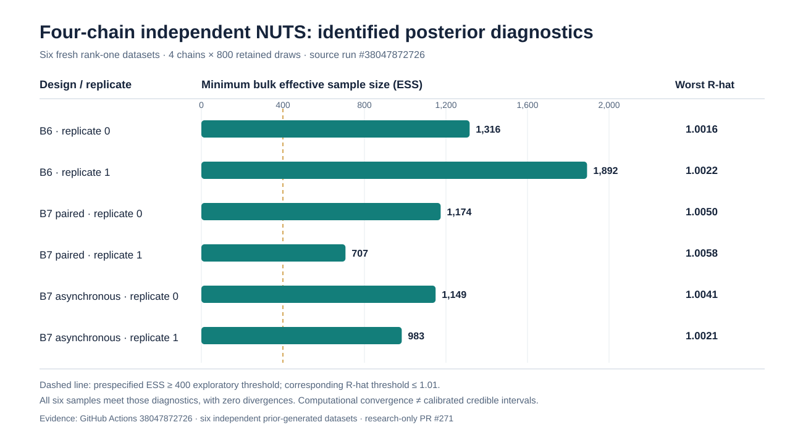

# Original experimental research figures

!!! warning "Interpretation and provenance"
    These are **original source-verified research SVG assets**; the earlier figures were copied from their named draft branches and the newer long-chain plot was constructed from the original retained scientific case results, not generic stock illustrations. They visualize simulation evidence, not results from human-subject recordings. Their presence here does not make the underlying experimental methods available in the stable 1.1.0 installation.

## Sparse-group inference F1

[Independent fitted F1 null/power study](f1-high-precision-native-null-power.md) · [Source run #37977625803](https://github.com/stefanosbalaskas/eyetrajectoriespy/actions/runs/37977625803)

## Bayesian B6/B7

[Exact partially collapsed population-mean experiment](b6-b7-exact-collapsed-mean-gibbs.md)

[Negative joint-loading sampler experiment](b6-b7-joint-score-marginal-loading-ess.md) · [Original source #38000101053](https://github.com/stefanosbalaskas/eyetrajectoriespy/actions/runs/38000101053)

### Longer-chain independent covariance reference: nine source fits

[Full original-source study, B6/B7 results and limitations](b6-b7-longchain-identified-covariance-geometry.md) · [Original workflow #38039822342](https://github.com/stefanosbalaskas/eyetrajectoriespy/actions/runs/38039822342) · Original artifacts: `11665746776`, `11665707552`, `11665607799`.

*This added scientific SVG is source-accurately constructed from the nine original fitted case results; it is not an independently collected dataset and does not establish posterior coverage.*

### Four-chain independent reference, two fresh datasets per rank-one design

[Six-fit source results, full provenance and unqualified inference limits](b6-b7-four-chain-nuts-r1-reference.md) · [Original workflow #38047872726](https://github.com/stefanosbalaskas/eyetrajectoriespy/actions/runs/38047872726).

*All six four-chain fits passed the exploratory mixing diagnostics; this is not evidence of 90% interval coverage or rank-two validity. The plot depicts one rank-one fit per replicate (six independently generated datasets), not independent posterior interval calibration.*

### Rank-one prior-SBC pilot: original four-dataset midpoint ranks

[Four-dataset SBC stage-0 report, original ranks and diagnostic failure](b6-rank1-prior-sbc-stage0.md) · [Source workflow #38087405506](https://github.com/stefanosbalaskas/eyetrajectoriespy/actions/runs/38087405506).

*The four datasets are insufficient for rank-uniformity or interval-coverage claims. One completed posterior fit failed the exploratory computational convergence screen; that failure is explicitly shown. The [rank-two mathematical validation](b6-b7-rank2-marginal-mathematics.md) is presented as a source-audited numerical contract, without an invented discrepancy plot because exact case-level differences must be read from the retained source artifacts.*

## F5 change-point null behavior

[External-baseline dependence testing](independent-core-computation-and-f5-ar1-reference.md)

[Unknown-AR(1) external-baseline study](f5-independent-baseline-unknown-phi.md)

[AR(2) / MA(1) / nonstationary falsification](f5-independent-baseline-ar2-model-falsification.md) · [Source run #38000177988](https://github.com/stefanosbalaskas/eyetrajectoriespy/actions/runs/38000177988)

## Reproducible provenance

These figures are version-controlled scientific assets in the research PRs, embedded **without regenerating simulated results using a different source state**. For source dataset counts, original workflow artifacts and SHA256 audit evidence, consult the [scientific dashboard](research-scientific-dashboard.md).

Figures for earlier E1–E4 workflows remain available through the existing [experimental gallery](../methods/experimental-e1-e4-gallery.md). Other proposed B5–B10 or F1–F6 demonstrations that lack an original committed SVG are not represented here as if they were completed research figures.
