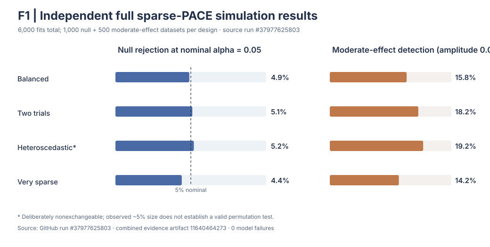
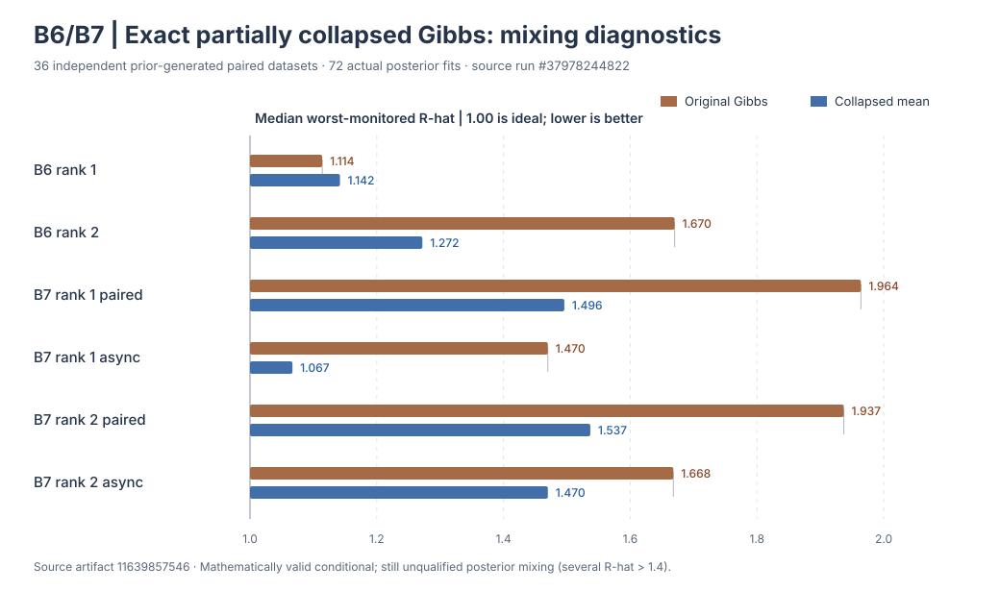
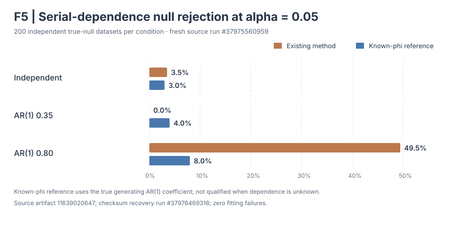
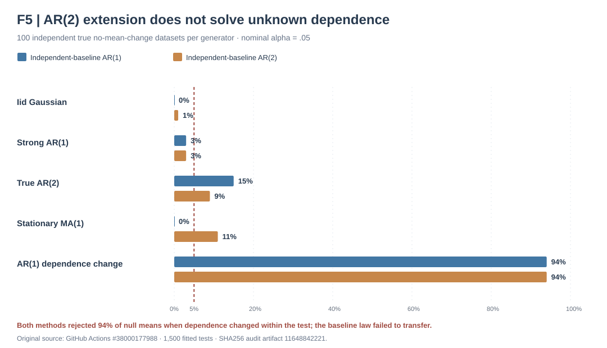

# Original experimental research figures

!!! warning "Interpretation and provenance"
    These are **original research SVG assets copied from the named draft branches**, not generic stock illustrations. They visualize simulation evidence, not results from human-subject recordings. Their presence here does not make the underlying experimental methods available in the stable 1.1.0 installation.

## Sparse-group inference F1

[Independent fitted F1 null/power study](f1-high-precision-native-null-power.md) · [Source run #37977625803](https://github.com/stefanosbalaskas/eyetrajectoriespy/actions/runs/37977625803)

## Bayesian B6/B7

[Exact partially collapsed population-mean experiment](b6-b7-exact-collapsed-mean-gibbs.md)

[Negative joint-loading sampler experiment](b6-b7-joint-score-marginal-loading-ess.md) · [Original source #38000101053](https://github.com/stefanosbalaskas/eyetrajectoriespy/actions/runs/38000101053)

## F5 change-point null behavior

[External-baseline dependence testing](independent-core-computation-and-f5-ar1-reference.md)

[Unknown-AR(1) external-baseline study](f5-independent-baseline-unknown-phi.md)

[AR(2) / MA(1) / nonstationary falsification](f5-independent-baseline-ar2-model-falsification.md) · [Source run #38000177988](https://github.com/stefanosbalaskas/eyetrajectoriespy/actions/runs/38000177988)

## Reproducible provenance

These figures are version-controlled scientific assets in the research PRs, embedded **without regenerating simulated results using a different source state**. For source dataset counts, original workflow artifacts and SHA256 audit evidence, consult the [scientific dashboard](research-scientific-dashboard.md).

Figures for earlier E1–E4 workflows remain available through the existing [experimental gallery](../methods/experimental-e1-e4-gallery.md). Other proposed B5–B10 or F1–F6 demonstrations that lack an original committed SVG are not represented here as if they were completed research figures.
