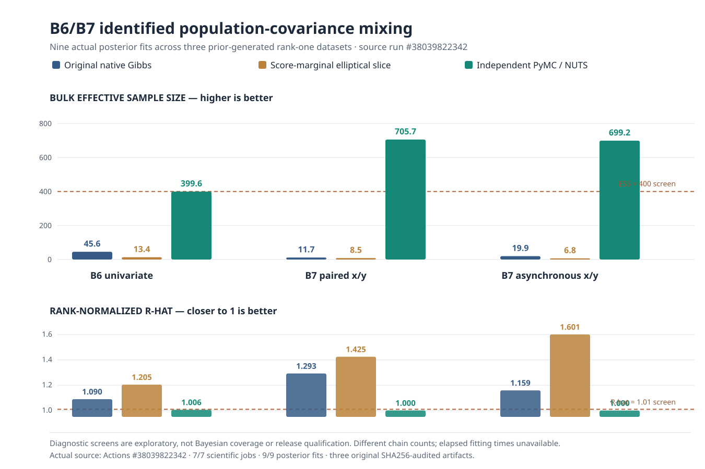

# Scientific evidence dashboard — unreleased 1.2

!!! danger "Evidence is not inferential qualification"
    **Stable PyPI: 1.1.0. Development research: unpublished.** Source simulations and CI provide reproducible experimental *evidence*, not proof that reported p-values, credible intervals or predictive intervals are valid across real eye-tracking designs. Research implementation code stays in **draft branches**, not in stable 1.1.0 or the public-main default.

**Evidence checkpoint:** October 10, 2026. Counts below refer to actual source-run attempts, not distinct human participants. When two methods share a test dataset, the *test dataset* is the independent simulation unit.

| Research gate | Original source run | Actual method fits | Critical evidence | Qualification |
|---|---|---:|---|---|
| F1 sparse group inference | [#37977625803](https://github.com/stefanosbalaskas/eyetrajectoriespy/actions/runs/37977625803), artifact `11640464273` | **6,000**, 0 failures | 4,000 null and 2,000 fixed moderate-effect alternatives, 199 permutations each; observed null rejection 4.4–5.2% at nominal 5% across four tested regimes, moderate-effect detection 14.2–19.2% | **Limited evidence, not general qualification** |
| B6/B7 independent NUTS | [#37988738287](https://github.com/stefanosbalaskas/eyetrajectoriespy/actions/runs/37988738287), artifact `11645572128` | **3 PyMC posterior fits**, no divergences | Genuine separate PyMC likelihood works; intervals overlap, but native covariance chains mix inadequately | **Blocked: #255** |
| B6/B7 identifiable diagnostics | [#37992812846](https://github.com/stefanosbalaskas/eyetrajectoriespy/actions/runs/37992812846), artifact `11647146899` | 3 independent posterior comparisons | B6 covariance native R-hat/ESS 1.357/5 versus PyMC 1.001/183; async B7 covariance native 1.718/3 versus PyMC 1.006/249 | **Blocked: #255** |
| B6/B7 longer-chain original Gibbs, elliptical slice and independent NUTS | [#38039822342](https://github.com/stefanosbalaskas/eyetrajectoriespy/actions/runs/38039822342); B6 artifact `11665746776`, paired B7 `11665707552`, asynchronous B7 `11665607799` | **9 actual posterior fits** on 3 newly prior-generated datasets; 0 exceptions; SHA256 audit passed | Native midpoint covariance bulk ESS **45.6/11.7/19.9** (B6/paired/async); score-marginal ESS **13.4/8.5/6.8**; independent NUTS **399.6/705.7/699.2**, all NUTS 0 divergences; no per-method fit times | **Native covariance not qualified; NUTS promising, not coverage-qualified. Blocker #255 open** |
| B6/B7 four-chain independent NUTS R1 | [#38047872726](https://github.com/stefanosbalaskas/eyetrajectoriespy/actions/runs/38047872726), six source-audited artifacts (see [study](b6-b7-four-chain-nuts-r1-reference.md)) | **6 independent four-chain NUTS fits** (2 per rank-one design), 0 fitting errors; audit passed | All 6 passed exploratory identified-functionals screen, worst R-hat **1.0058**, lowest bulk ESS **707**, minimum BFMI **0.770**, zero divergences; 6–15 functionals per dataset; no rank-two or rank-SBC evidence | **Promising reference computation only; nominal coverage and publication remain blocked by #255** |
| B6/B7 rank-two dense-Gaussian/Woodbury mathematical reference | [#38087129154](https://github.com/stefanosbalaskas/eyetrajectoriespy/actions/runs/38087129154), original artifacts `11681893932`, `11682179563`, `11681983569` | **4 mathematical cases** run on Python 3.11–3.13; 0 contractual failures | Dense observed-data Gaussian equals independent rank-2 Woodbury within specified tolerance under paired/asynchronous layouts, orthogonal rotation, near ties (near-tied stress out of prior) | **Mathematics qualified for tested identities only; PyMC graph, gradients, sampler and SBC absent. #255 open** |
| B6/B7 rank-two actual PyMC log posterior and gradients | [#38095088126](https://github.com/stefanosbalaskas/eyetrajectoriespy/actions/runs/38095088126); source artifacts `11685812328`, `11685872136`, `11685108432`, `11685956885` | **4 real PyMC graph and AD evaluations** (paired/asynchronous × matched-prior/near-tied), 30 derivatives per case; 0 contract errors | Worst absolute full log-posterior discrepancy **8.53×10⁻¹⁴** and scaled gradient discrepancy **1.11×10⁻⁸** against independent dense Gaussian and numerical differentiation; proper isotropic normal priors, rotation invariance | **Actual graph mathematics verified in tested cases only; rank-two NUTS, SBC and coverage not done. #255 open** |
| B6 prior-SBC stage-0 rank-one pilot | [#38087405506](https://github.com/stefanosbalaskas/eyetrajectoriespy/actions/runs/38087405506), original aggregate artifact `11683762021` and 4 individual case artifacts | **4/4 full independent NUTS fits**, 0 fitting errors; 1 of 4 failed exploratory screen | Prespecified primary midpoint truth ranks (mean) 1,198/912/124/324 and (variance) 1,395/953/1,353/1,132 (of 1,600 draws each). Both intervals include truth 4/4; one dataset has worst R-hat 1.0158 despite zero divergences | **Infrastructure pilot only: no SBC rank uniformity or nominal coverage claims. #255 open** |
| B6/B7 joint-loading ESS | [#38000101053](https://github.com/stefanosbalaskas/eyetrajectoriespy/actions/runs/38000101053), artifact `11649475504` | **36** (18 independently generated datasets × 2 methods), 0 failures | No fit passed identifiable-covariance R-hat ≤1.01 and bulk ESS ≥400; no consistent mixing improvement | **Negative comparator, not promoted** |
| F5 independent-baseline unknown AR(1) | [#37987935105](https://github.com/stefanosbalaskas/eyetrajectoriespy/actions/runs/37987935105), artifact `11643259568` | **2,520**, 0 failures | Strong-AR(1) null false positives reduced, but iid/weak-AR(1) conservatism and AR(2) misspecification remained | **Blocked: #256** |
| F5 baseline-size uncertainty ablation | [#37992161919](https://github.com/stefanosbalaskas/eyetrajectoriespy/actions/runs/37992161919), artifact `11645662411` | **3,600** (600 independent test datasets × 6 paired conditions), 0 failures | Strong-AR(1) plug-in false positive 24/12/9% for training n=40/80/160; uncertainty propagation 3/1/5%; true-AR(2) under uncertainty propagation 27/12/15% | **Blocked: #256** |
| F5 independently trained AR(2) stress | [#38000177988](https://github.com/stefanosbalaskas/eyetrajectoriespy/actions/runs/38000177988), artifact `11648842221` | **1,500** (750 independent test datasets × 2 methods), 0 failures | Under true AR(2), null 15% AR(1) vs 9% AR(2); MA(1) 0% vs 11%; within-test nonstationarity **94% false rejection for both** | **Blocked: #256** |

### B6/B7 long-chain completed posterior pilot: native covariance mixing still unqualified

The [nine-fit source-verified study](b6-b7-longchain-identified-covariance-geometry.md) uses **three new prior-generated rank-one datasets**, not nine independent subjects or nine independent posterior-truth replications. Identifiable covariance posterior fit outcomes:

| Design | Original Gibbs R-hat / bulk ESS | Score-marginal elliptical slice R-hat / bulk ESS | Independent NUTS R-hat / bulk ESS |
|---|---|---|---|
| B6 univariate | 1.090 / 45.6 | 1.205 / 13.4 | **1.006 / 399.6** |
| B7 paired | 1.293 / 11.7 | 1.425 / 8.5 | **1.001 / 705.7** |
| B7 asynchronous | 1.159 / 19.9 | 1.601 / 6.8 | **1.000 / 699.2** |

The prespecified exploratory covariance mixing screen (rank R-hat ≤1.01 and bulk ESS ≥400) was met **only by both B7 NUTS studies**. B6 NUTS had ESS **399.6**, effectively at—but formally below—the threshold. All three NUTS runs reported zero divergences. The native covariance chains remained poorly mixed in every design; **fitted posterior means being similar to NUTS does not make those native results reliable**. All reported 90% intervals happened to contain their single generated truth; *this is not an estimate of repeated-sampling coverage*. These absolute ESS values also **cannot** establish runtime efficiency because native uses four chains and NUTS two, with no per-method timing recorded.

[Scientific blocker #255](https://github.com/stefanosbalaskas/eyetrajectoriespy/issues/255) remains unresolved; independently converged four-chain posterior references, rank-2 and SBC/coverage simulations remain necessary.

### F1: limited null calibration, modest sensitivity

| Sparse regime | Observed null rejection (1,000 independent datasets) | Fixed moderate-effect rejection (500 datasets) |
|---|---:|---:|
| Balanced | 49/1,000 (4.9%) | 79/500 (15.8%) |
| Clustered two trials | 51/1,000 (5.1%) | 91/500 (18.2%) |
| Unequal heteroscedastic | 52/1,000 (5.2%) | 96/500 (19.2%) |
| Very sparse | 44/1,000 (4.4%) | 71/500 (14.2%) |

The results **do not** identify useful power across other sample sizes, effect shapes, missingness mechanisms, nuisance covariance choices or participant-exchangeability structures. Do not promote this as a generally calibrated test based only on one simulation grid. [Method and source figure](f1-high-precision-native-null-power.md).

### Bayesian convergence: identifiable covariance, not raw sign-ambiguous factors

| Quantity | Independent PyMC rank R-hat / bulk ESS | Native Gibbs rank R-hat / bulk ESS |
|---|---:|---:|
| B6 midpoint population covariance | 1.001 / 183 | **1.357 / 5** |
| B7 paired midpoint x/y covariance | 1.002 / 281 | **1.062 / 34** |
| B7 asynchronous midpoint x/y covariance | 1.006 / 249 | **1.718 / 3** |

The PyMC reference is **not fully qualified** either: bulk ESS <400 in these cases, and R-hat on identified quantities does not guarantee valid credible-interval coverage. The native sampler remains a serious scientific blocker. [Independent comparison](b6-b7-identifiable-reference-diagnostics.md), [negative sampler experiment](b6-b7-joint-score-marginal-loading-ess.md).

### F5: falsification matters more than the best-looking model

At nominal 5%, independently trained AR(1) vs AR(2) mean-null rejection counts per **100 independent datasets** were iid **0 vs 1**, strong AR(1) **3 vs 3**, true AR(2) **15 vs 9**, stationary MA(1) **0 vs 11**, and dependence changing within the test **94 vs 94**. The 9/100 nominal-rate estimate has a wide exact Monte Carlo interval (approximately **4.2–16.4%**). Inflated true-null rejection makes higher alternative-rejection proportions unsuitable as calibrated power comparisons.

[AR(2)/nonstationary falsification](f5-independent-baseline-ar2-model-falsification.md) · [Baseline duration](f5-baseline-size-nuisance-sensitivity.md).

## Unresolved gates

| Work | Independent validation still required |
|---|---|
| Bayesian B6/B7 | Rank-one computational screening replicated; rank-two graph validated in four mathematical cases; actual rank-two NUTS computation, many-dataset SBC, repeated nominal coverage and held-out predictive calibration remain |
| F5 | A theoretically defensible dependence-robust null with stationary assumptions, external diagnostics, transportability constraints, nonstationary counterexamples and larger independent null simulations |
| F1 | Sample-size/effect-size power surfaces, missingness/covariance stress, permutation exchangeability and independent comparators |
| F2/F3/F4/F6 | Target/coordinate provenance, official Eye-Tracking-BIDS validator and real-data checks, constrained AOI estimator validation, weighted geometry verification |
| Real recordings | Independent dense, asynchronous sparse and repeated-participant examples with source data, failure cases, reproducible outputs and appropriate permissions |

**The 1.2 release and all scientific promotion flags remain false.** Public documentation of these findings changes none of those gates.
