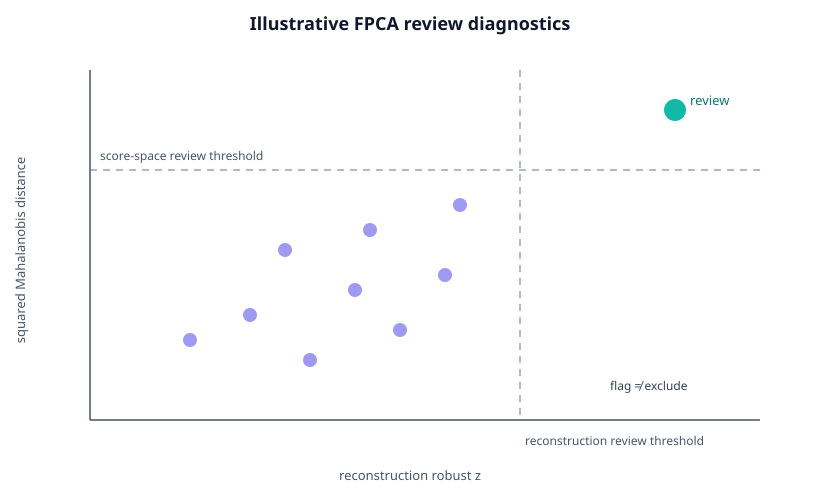

# Functional outliers and FPCA influence

*Illustrative synthetic diagnostic geometry. A review flag identifies a trajectory to inspect; it is not an exclusion command.*

Functional trajectories can be unusual for several different reasons:

- a genuine but rare viewing strategy;
- stimulus/layout mismatch;
- tracker failure or preprocessing artifact;
- an influential participant whose curves strongly shape the FPCA basis;
- ordinary tail variation.

These are not interchangeable. **An outlier flag is not an exclusion rule.**

## Two complementary FPCA diagnostics

`diagnose_fpca_outliers()` combines two views of the same fitted sample.

### Reconstruction behavior

The fitted FPC basis is used to reconstruct each trajectory. Integrated reconstruction RMSE is converted to a robust modified-z score.

A large reconstruction error means the retained basis represents that trajectory poorly.

### Score-space behavior

Retained FPC scores are evaluated with squared Mahalanobis distance. The default covariance estimate is Minimum Covariance Determinant, which is more resistant to extreme score vectors than the ordinary empirical covariance.

A trajectory can have a small reconstruction error but still be extreme in score space because the FPCA basis itself may have adapted to it.

That is why the package reports both diagnostics.

    result = diagnose_fpca_outliers(
        fit,
        gaze,
        n_components=4,
        reconstruction_z_threshold=3.5,
        score_alpha=0.99,
        score_covariance="robust",
        random_state=2026,
    )

    result.diagnostics

The output contains separate `reconstruction_flag`, `score_flag`, and combined `review_flag` columns.

!!! danger
    `review_flag=True` means **inspect this trajectory**. It does not mean delete it.

## Participant-aware influence

Repeated eye-tracking trials make curve-level leave-one-out analysis misleading when many curves come from the same participant.

Use:

    influence = leave_one_group_out_fpca_influence(
        gaze,
        group_column="participant_id",
        n_components=3,
        scaling="dimension_sd",
    )

Every participant is omitted as a block and FPCA is refitted.

The refitted components are matched to the full-sample reference components by maximum absolute functional similarity.

The summary reports:

- minimum matched component similarity;
- mean matched component similarity;
- maximum absolute explained-variance change;
- mean absolute explained-variance change;
- a descriptive influence score, defined as one minus the minimum matched similarity.

## When influence matters

A participant can be influential without being invalid.

Large influence can indicate:

- a genuine rare strategy;
- a subgroup not represented elsewhere;
- condition imbalance;
- stimulus-specific behavior;
- processing failure;
- insufficient sample size for a stable covariance estimate.

Inspect the trajectory and study metadata before drawing conclusions.

## Optional functional-depth backends

The `fda` optional dependency exposes scikit-fda functional outlier methods:

    result = detect_functional_outliers_skfda(
        gaze,
        dimension="x",
        method="boxplot",
        factor=1.5,
    )

Available wrappers are:

- `method="boxplot"`: functional boxplot screening;
- `method="msplot"`: magnitude-shape directional-outlyingness screening.

These methods answer a different question from FPCA score-space diagnostics and can be used as sensitivity analyses.

## Recommended manuscript workflow

1. Apply acquisition/QC exclusions using rules defined independently of the functional results.
2. Fit the planned FPCA.
3. Inspect reconstruction and score-space review diagnostics.
4. Run participant-level influence when trials are repeated within people.
5. Investigate flagged/influential cases using raw/preprocessed data and metadata.
6. Refit only as a documented sensitivity analysis if exclusion is scientifically justified.
7. Report whether substantive conclusions changed.

## What not to do

Do not:

- remove every curve flagged by an algorithm;
- tune thresholds until a desired condition effect appears;
- treat a rare trajectory as measurement error without evidence;
- run curve-level omission when participant-level dependence is the relevant unit;
- call a robust-distance cutoff a formal hypothesis test.
