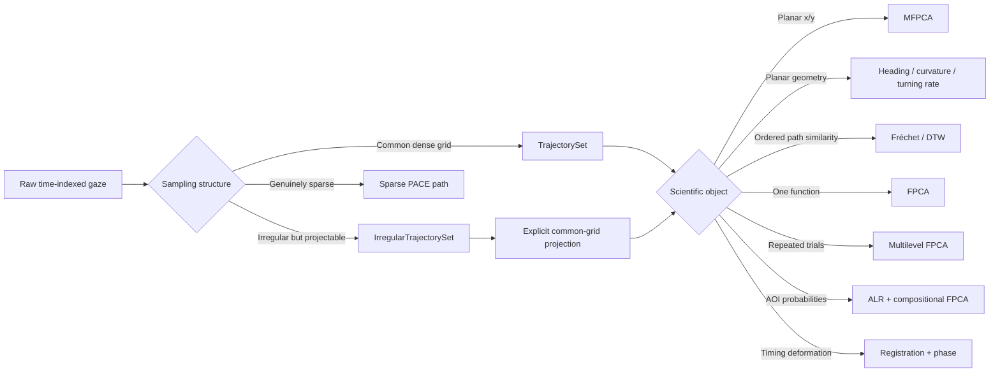
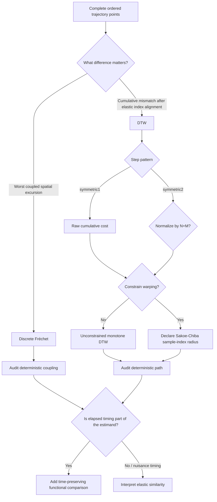
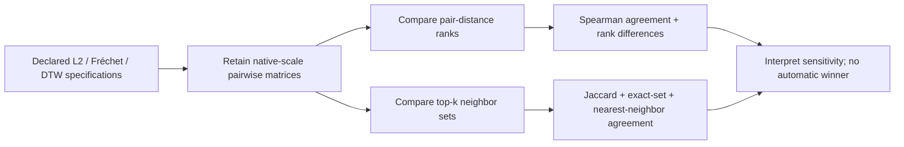
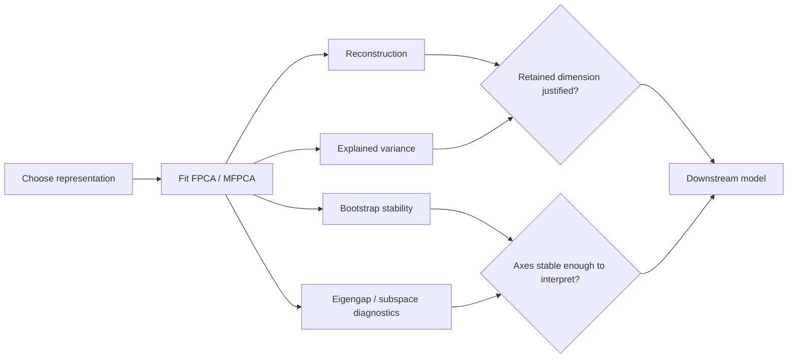
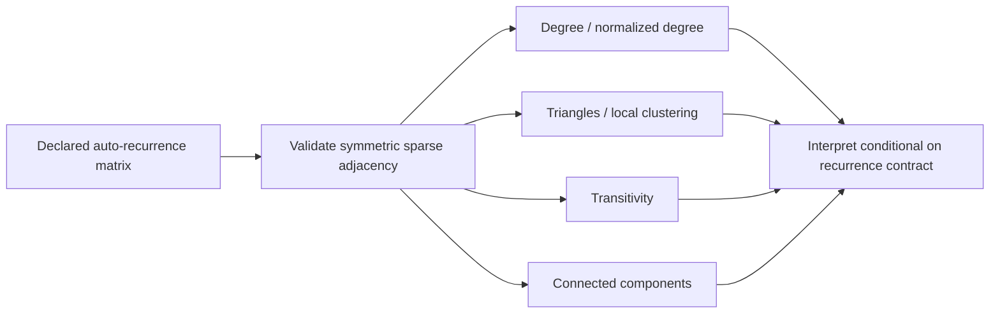
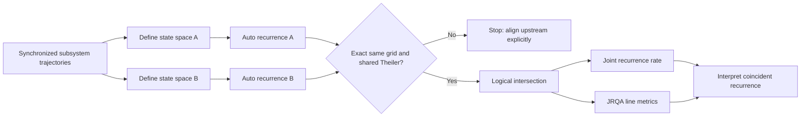
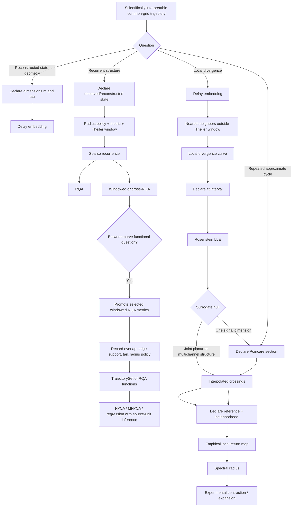
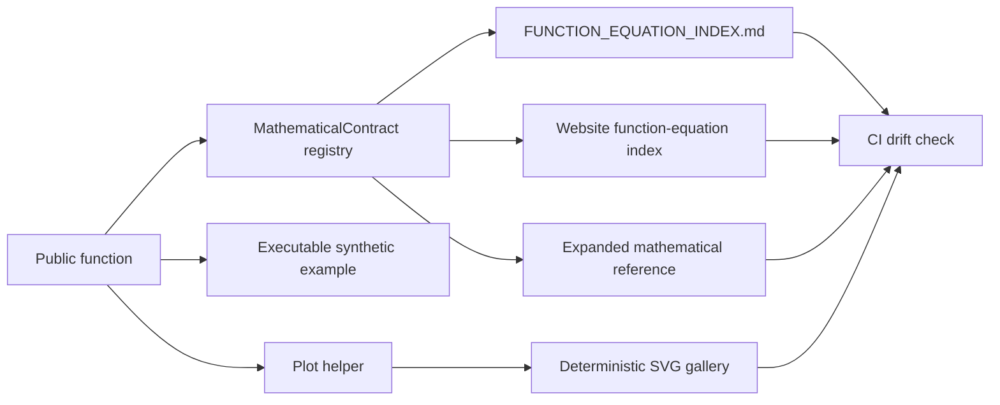

# Workflow atlas

These diagrams show **decision order**, not an automatic pipeline. eyetrajectoriespy keeps preprocessing, representation, inference unit, resampling design, and inferential scope explicit.

## Representation first



## Repeated-measures functional regression

```mermaid
flowchart TD
    A[Common-grid functional response Y_ij(t)] --> B[Curve-level scalar design X_ij]
    A --> C[Participant grouping]
    B --> D{Predictor varies within participant?}
    D -->|No and participant-average estimand desired| E[0.35 participant aggregation is available]
    D -->|Yes or all trials should remain| F[0.36 functional mixed-effects regression]
    C --> F
    F --> G[Declare fixed B-spline basis]
    F --> H[Declare participant random B-spline basis]
    G --> I[One stacked Gaussian MixedLM]
    H --> I
    I --> J[Fixed coefficient functions beta(t)]
    I --> K[Participant random functions b_i(t)]
    I --> L[Residual variance + convergence/boundary diagnostics]
    J --> M{Whole-function inference?}
    M -->|Yes| N[Whole-participant bootstrap]
    N --> O[Fixed-covariance GLS coefficient refits]
    O --> P[Coefficient/family supremum calibration]
    P --> Q[Observed-grid simultaneous band]
```

The 0.36 path is one joint mixed model over all curve-by-time observations.
It does not run independent mixed models at each time point and does not
silently average trial-varying predictors.

Version 0.44 resamples complete participant trial bundles for simultaneous
fixed-coefficient inference. The reference random-effect covariance, residual
variance, and declared bases remain fixed, so the band is conditional on that
covariance/basis contract and simultaneous over the observed grid only.

## Functional response regression

```mermaid
flowchart TD
    A[Common-grid functional response Y(t)] --> B{Independent sampling unit}
    B -->|Independent curves| C[unit=curve]
    B -->|Repeated trials, participant-level predictors| D[Average response within participant]
    D --> E{Predictors constant within participant?}
    E -->|No| F[Stop: repeated-measures functional model required]
    E -->|Yes| G[Equal-weight participant design]
    C --> H[Explicit numeric scalar design]
    G --> H
    H --> I[Observed-grid OLS beta(t)]
    I --> J[HC1 pointwise SE]
    I --> K[Whole-function fixed-design wild bootstrap]
    K --> L{Simultaneous scope}
    L -->|Coefficient| M[Max over time x dimension per coefficient]
    L -->|Family| N[Max over coefficient x time x dimension]
    M --> O[Observed-grid simultaneous band]
    N --> O
```

Version 0.35 does not infer categorical coding, interactions, smoothing, basis regularization, or participant random effects. Trial-varying within-participant predictors stop at the explicit repeated-measures boundary rather than being approximated by independent pointwise models.

## Ordered trajectory similarity



Fréchet and DTW use sequence order, not the numeric TrajectorySet time grid. Fréchet reports a bottleneck maximum. DTW requires an explicit step pattern: symmetric1 preserves the raw cumulative 0.33 contract, while symmetric2 supports the defined N+M normalization. Neither contract silently resamples, smooths, chooses a step pattern, normalizes, or chooses a warping window.

If multiple distance contracts remain defensible, continue to:




## FPCA validation before interpretation



## Gaussian FPCR inference branches

```mermaid
flowchart TD
    A[FPCA scores + scalar outcome] --> B{Scientific target}
    B -->|Sampling uncertainty in fitted FPCR| C[Paired full-pipeline bootstrap]
    B -->|Heteroscedastic fixed-target projection| D[Fixed-regressor wild bootstrap]
    C --> E[Conditional mean uncertainty]
    C --> F[Observed-grid slope band]
    C --> G[Future-outcome interval]
    D --> H[Target-wise interval]
    D --> I[Fixed-family max-|t| interval]
    D --> J[Fixed-family tests]
    J --> K[Monte Carlo precision audit]
```

## Recurrence-network topology



The graph does not retune the recurrence radius, restore Theiler-excluded
edges, optimize communities, or infer dynamical dimension automatically.

## Joint recurrence across synchronized systems



Joint recurrence does not perform lag search, resampling, synchronization
repair, or threshold harmonization.

## Nonlinear trajectory dynamics



!!! warning
    The return-map branch is empirical. It does not produce a classical monodromy matrix or Floquet multipliers. Numerical continuation likewise requires a separately identified dynamical model.

## Function → equation → figure



## Use the atlas with the contracts

- [Function → equation index](../reference/function-equation-index.md) gives the concise LaTeX contract for each registered function.
- [Mathematical reference](mathematical-reference.md) expands the equations and boundaries.
- [Visual gallery](visual-gallery.md) shows representative public plotting outputs.
- [Tutorial gallery](../tutorials/index.md) provides runnable scientific workflows.
- [Assumptions](assumptions.md) and [limitations](limitations.md) define where each workflow stops.

## Directed discrete-state dependence

```text
explicit discrete source/target states
        |
        +--> declare k, l, source lag d
        |       |
        |       +--> discrete_transfer_entropy()
        |               |
        |               +--> mean TE in bits
        |               +--> local TE/history frame
        |               +--> empirical support diagnostics
        |
        +--> declare defensible circular source shifts
                |
                +--> transfer_entropy_circular_shift_test()
                        |
                        +--> surrogate distribution / centered TE
                        +--> plus-one upper-tail p-value
```

No branch in this workflow automatically bins continuous measurements, chooses
history/lag settings, generates shifts, or promotes directed prediction to
causal identification.

## Transfer-entropy robustness multiverse

```text
explicit discrete state series
        |
        +--> declare K: target histories
        +--> declare L: source histories
        +--> declare D: source lags
                    |
                    v
        full Cartesian K × L × D
                    |
                    v
 transfer_entropy_parameter_sensitivity()
        |           |             |
        |           |             +--> support diagnostics
        |           +--> optional common circular-shift null
        +--> complete TE table
                    |
                    v
         explicit one-parameter slices
         no hidden averaging / no winner
```

## Conditional transfer entropy

```text
X: explicit discrete source
Y: explicit discrete target
Z: explicit discrete conditioning process
        |
        +--> k, l, m histories
        +--> d, c lags
                    |
                    v
 conditional_transfer_entropy()
        |           |
        |           +--> local contributions
        |           +--> effective indices
        |           +--> exact histories
        |           +--> empirical support diagnostics
        |
        +--> optional source-only circular shifts
                    |
                    v
 conditional_transfer_entropy_circular_shift_test()
        target and condition remain fixed
                    |
                    v
 incremental predictive information
 not proof of causal influence
```
